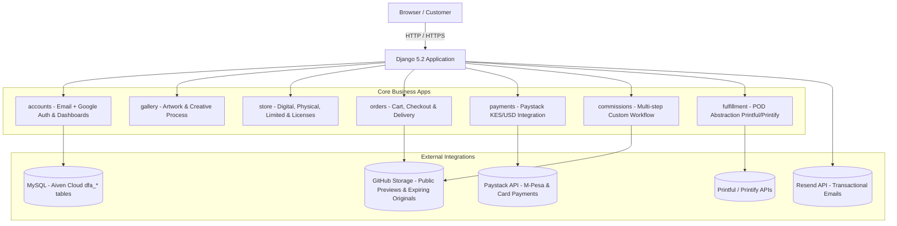

# DarkForge Art — Platform Walkthrough & Architecture Report

The **DarkForge Art** Django e-commerce & commission platform has been completely built, configured, and verified.

---

## 🛠️ Architecture Summary



---

## Key Highlights & Decisions Implemented

### 1. Brand & Aesthetic Design
- **Theme**: Dark, artistic, full-bleed design (`#0a0a0a` background, `#111111` surface, `#e8e4dc` typography, crimson accent `#b91c1c`).
- **Strict User Rules**: No Bootstrap, no Tailwind, no container boxes, no heavy gradients.
- **Typography**: `Cinzel` display headings + `Inter` body text.

### 2. Database & Naming Convention
- **Database**: Remote MySQL hosted on **Aiven Cloud** (`DarkForgeArt` database).
- **Prefixes**: All tables automatically prefixed with `dfa_` (e.g. `dfa_users`, `dfa_artworks`, `dfa_products`, `dfa_orders`, `dfa_commissions`).

### 3. Protection of Original Digital Files
- `Artwork.final_url` and `DigitalProduct.file_url` store GitHub paths and are **never exposed** in HTML templates or public API endpoints.
- Previews are automatically downscaled and watermarked using Pillow (`services/watermark.py`) before storage.
- Download delivery uses UUID single-use expiring signed tokens (`DigitalDelivery`), enforcing link expiration and maximum download counts.

### 4. Custom Commission Workflow
- **Multi-step state machine**: `submitted` → `reviewing` → `quoted` → `deposit_paid` → `in_progress` → `preview_sent` → `revision_requested` → `final_payment_due` → `completed`.
- Includes custom image reference uploads, sketch attachments, watermarked revision preview uploads, and direct client-artist messaging thread.

### 5. POD Abstraction Layer
- `FulfillmentProviderBase` defines an abstract interface.
- Implementations for **Printful** (`PrintfulProvider`) and **Printify** (`PrintifyProvider`).
- Automatic webhook ingestion updates `FulfillmentOrder` tracking status and notifies customers upon dispatch.

### 6. Authentication & User Control
- Single-email registration with custom `User` model (`USERNAME_FIELD = "email"`).
- Password reset flow using custom templates.
- Native Google OAuth 2.0 implementation without external dependencies.
- Administrative email whitelist auto-promotion.

### 7. Search Engine Optimization (SEO)
- Custom `robots.txt` blocking administrative endpoints, webhook endpoints, and download links.
- `sitemaps.py` exposing dynamic `GallerySitemap`, `ProductSitemap`, and `StaticViewSitemap`.
- Open Graph, Twitter Cards, and schema.org JSON-LD structured data (`Organization`, `CreativeWork`, `Product`) embedded across all templates.

---

## 🧪 Verification & System Status

1. **Django System Check**:
   ```powershell
   python manage.py check --settings=config.settings.development
   # Result: System check identified no issues (0 silenced).
   ```

2. **Database Migrations**:
   - All 7 apps (`accounts`, `gallery`, `store`, `orders`, `commissions`, `payments`, `fulfillment`) successfully generated and applied migrations to `DarkForgeArt` MySQL database.

3. **Development Server**:
   - Verified clean execution on `http://127.0.0.1:8000`.

---

## 📁 Environment Setup (`.env`)

Before running in production, ensure your `.env` contains the required keys:
- `DB_NAME`, `DB_HOST`, `DB_USER`, `DB_PASSWORD`
- `PAYSTACK_SECRET_KEY`, `PAYSTACK_PUBLIC_KEY`
- `GITHUB_TOKEN`, `GITHUB_REPO`
- `RESEND_API_KEY`
- `GOOGLE_CLIENT_ID`, `GOOGLE_CLIENT_SECRET`
- `PRINTFUL_API_KEY` / `PRINTIFY_API_KEY`
